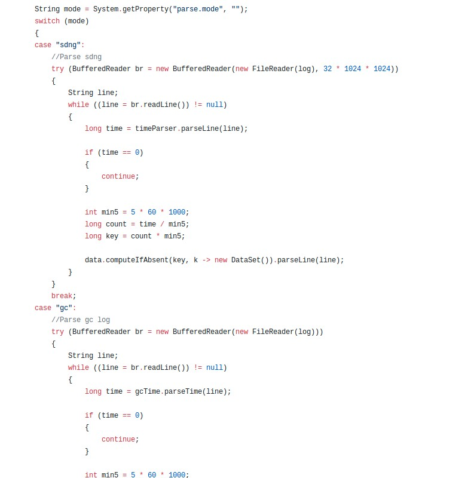
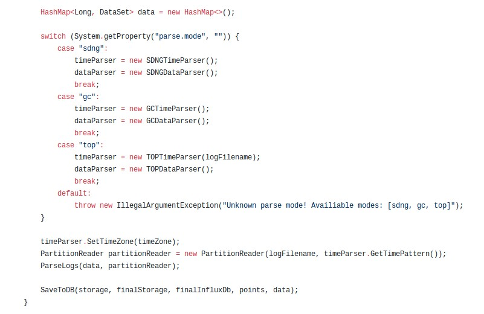
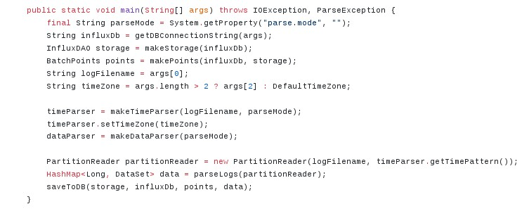
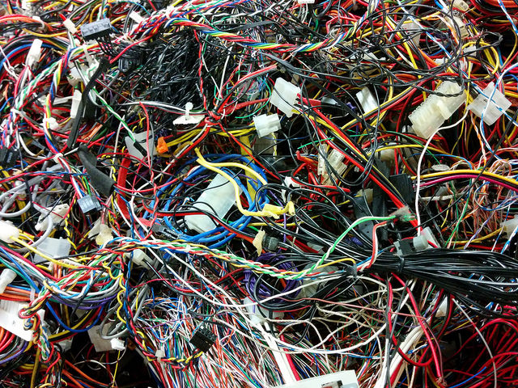
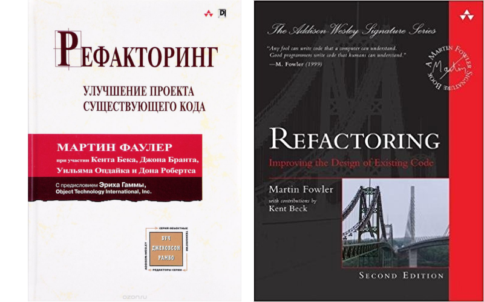
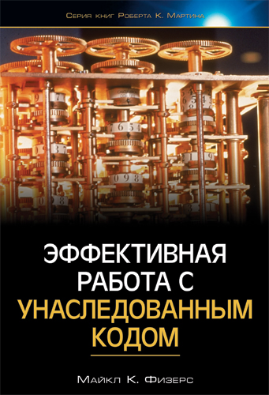
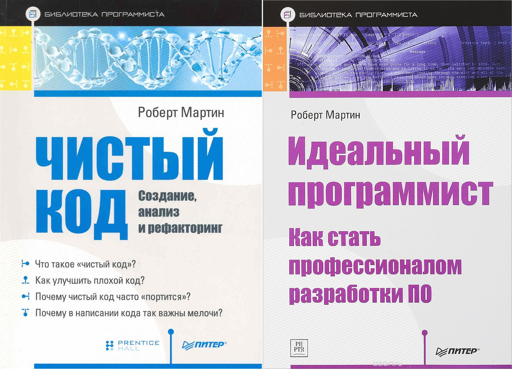

# Чистый код
---
## Что такое чистый код
---
### Реалии командной разработки

Размер кодовой базы в строчках (примерно):

 * Маленький проект: 1K ― 10K
 * Средний проект: 50K ― 500K
 * Большой проект: 1M ― 20M

Время жизни кода ― **годы**.

---
### Реалии командной разработки

---
### Что получается

1. Большую часть времени разработчик не пишет код, а читает существующий
1. Понятность кода существенно влияет на скорость разработки
1. Важно уметь писать понятный код

---
### 4 правила простого дизайна

1. Проходят все тесты
1. Код выражает намерение
1. Нет дублирования
1. Используется минимальное число элементов

(Кент Бек)

---
### Это чистый код?

---
### Это чистый код?

---
### Это чистый код?

---
## Как писать чистый код
---
### Главные принципы

1. Помнить, что код пишется для человека, который будет его читать!
1. Уважать стандарты форматирования
1. Использовать принцип наименьшего удивления

---
### Помнить, что код пишется для человека

---
### Уважать стандарты форматирования

1. Стандарты текущего проекта
1. Стандарты самого языка

Если стандарты проекта не нравятся, то сначала **договариваемся** об их изменениях, и только потом меняем код.

---
### Принцип наименьшего удивления

**Плохо**:

 * Сложные, неоднозначно читаемые конструкции
 * Форматирование в стиле ASCII-Art
 * Микрооптимизации в ущерб читаемости

Чистый код выглядит скучно, без сюрпризов.

---
### Типичные приёмы

1. Использовать выразительные имена
1. Писать внятные комментарии
1. Разбивать большие блоки кода
1. Уничтожать дублирование

---
### Использовать выразительные имена

**Плохо**

 * Однобуквенные имена (_если только это не часть формулы_)
 * Имена, не соответствующие реально выполняемому действию или хранимым данным
 * Разные названия для одних и тех же сущностей

Note: нужен ли слайд "хорошо"?

---
### Писать внятные комментарии

**Плохо**: комментарии дублируют код или названия методов.

**Хорошо**: комментарии указывают, _почему_ было сделано так, а не иначе.

---
### Разбивать большие блоки кода

---
### Разбивать большие блоки кода

---
### Разбивать большие блоки кода

---
### Уничтожать дублирование

"Правило трёх":

1. Код встречается один раз - всё ОК
1. Код встречается два раза - подозрительно, но может быть ок
1. Код встречается три раза - пора выносить!

---
## Крайности
---
### Только чистый код, только хардкор!

---
### И так сойдёт!

Экономия на чистоте кода приводит к техническому долгу

---
### Когда же писать чистый код?

* Код живёт долго ⇒ да
* Код одноразовый ⇒ нет
* Код изменяется ⇒ да
* Код никому не нужен ⇒ нет

Точное чутьё приходит с опытом

---
### Правило бойскаута

Не обязательно чистить сразу весь код.
Можно ограничиться небольшим улучшением, но зато делать это регулярно.

> Оставь место стоянки чище, чем оно было до твоего прихода

---
## Лучшие практики
---
### Рефакторинг

Изменение структуры кода _без изменения поведения_.
Примеры:

 * Переименование
 * Разбиение функций
 * Слияние функций
 * Перенос переменной в поле класса
 * ...

https://refactoring.com/

---
### Контроль версий

 * Всегда используйте Git или другой современный инструмент контроля версий
 * Отделяйте коммиты с рефакторингом от коммитов с изменением функциональности
 * Делайте частые коммиты!
 * Не стесняйтесь откатывать изменения, если _что-то пошло не так_

https://git-scm.com/book/ru/v2

---
### Автотесты

 * Гарантируют корректность рефакторинга
 * Позволяют оценивать удобство работы с кодом

Умейте их писать и поддерживать!

---
### Инструменты

 * **Линтеры**/**форматтеры** для правки и проверки стиля
 * **Статический анализ** для уменьшения числа дефектов
 * **IDE** для ускорения рефакторинга и прогона тестов
 * **CI**, чтобы поддерживать код в стабильном состоянии

---
## Как получить опыт

---

---
### Как получить опыт

 * Читать примеры кода (например, JUnit 4)
 * Участвовать в Open Source проектах
 * Упражнения: Code Kata
 * Читать книжки

---
### Code Kata

**Пример**: арабские цифры в римские:
<pre>
1 --> I
10 --> X
7 --> VII
</pre>

1. Решаем задачу
1. **Удаляем** код
1. Пытаемся написать ещё раз, более чисто

http://codingdojo.org

---
## Книжки

---
### Мартин Фаулер

---
### Майкл Физерс

---
### Роберт Мартин

---
## Профит

Что даёт чистый код:

 * Код проще понимать и изменять
 * Автора больше ценят и уважают

---
## Спасибо за внимание
### Вопросы?
